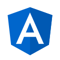

<h1 align="center">Design Angular Kit</h1>

<p align="center">
  
  <br>
  <i>Design Angular Kit is a toolkit based on Bootstrap Italia 
    <br> for the creation of web applications developed with Angular.</i>
  <br>
</p>

<p align="center">
  <a href="https://italia.github.io/design-angular-kit"><strong>italia.github.io/design-angular-kit</strong></a>
  <br>
</p>

<p align="center">
    <a href="https://www.npmjs.com/package/design-angular-kit"></a>
</p>

<p align="center">
    <a href="https://github.com/italia/design-angular-kit/actions"></a>
    <a href="https://codecov.io/gh/italia/design-angular-kit"></a>
    <a href="https://github.com/italia/design-angular-kit/blob/main/LICENSE"></a>
    <a href="https://github.com/italia/design-angular-kit/issues"></a>
</p>

<p align="center">
  <a href="https://github.com/semantic-release/semantic-release"></a>
  <a href="https://github.com/prettier/prettier"></a>
  <a href="https://github.com/eslint/eslint"></a>
</p>

<p align="center">
  <a href="https://developersitalia.slack.com/messages/C04H3C19D52/"></a>
  <a href="https://slack.developers.italia.it/"></a></p>

_Read this in other languages: [Italiano 🇮🇹](README.md)._

_⚠️ If you need the old version, the code and its documentation can be found [here](https://github.com/italia/design-angular-kit/tree/0.x)._

**Comments and contributions from the entire community are more than welcome!** 🎉

## Intro

**Design Angular kit** is a set of Angular components that implements [Bootstrap Italia](https://italia.github.io/bootstrap-italia/) and the styles found in [Design UI Kit](https://github.com/italia/design-ui-kit).
The public version of the library's documentation is available [here](https://italia.github.io/design-angular-kit) for the latest published stable release, and [here](https://design-angular-kit.vercel.app/) for the development version for the `main` branch.
To play with the library, the [Playground Angular Kit](https://github.com/italia/design-angular-kit-playground) is available.

## Index

- [How to use the kit](#come-usare-il-kit)
- [How-to-contribute](#come-contribuire-)
- [How-to-contribute-with-code](#come-contribuire-con-il-codice)
- [Useful links](#link-utili)

## How to use the kit

Design Angular Kit is available on NPM, to install on an existing application on which to test the library run command

```sh
npm install design-angular-kit --save
```

Choose the version corresponding to your Angular version:

| Angular | design-angular-kit |
| ------- | ------------------ |
| 18+     | v1.1.0 +           |
| 17+     | v1.0.0 +           |

Alternatively, you can run the command

```sh
ng add design-angular-kit --project <projectName>
```

He will consecutively perform:

- choose the correct Angular version
- install the dep
- add the dep to package.json
- application configuration

The instruction of the next chapter, **Configuration**, will be executed automatically, except for the customization of \_i18n.

## Configuration

### App configuration

The `design-angular-kit` library can be used with the _standalone_ components or with the application using the modules. Follow the
configuration that corresponds to your application.

#### Standalone application

Use the `provideDesignAngularKit` function in the application configuration `ApplicationConfig` to
initialise the library's functionality.

```typescript
import { provideDesignAngularKit } from 'design-angular-kit';

export const appConfig: ApplicationConfig = {
  providers: [...provideDesignAngularKit()],
};
```

#### Modular application

You need to import `DesignAngularKitModule` into the main application module (usually named **AppModule**)
using the `forRoot` method in order to initialise the library functionality and **import all components**.

```typescript
import { DesignAngularKitModule } from 'design-angular-kit';

@NgModule({
  imports: [...DesignAngularKitModule.forRoot()],
})
export class AppModule {}
```

Uses the `forChild` method when importing the `DesignAngularKitModule` into other modules of the application to **import all library components**.

```typescript
import { DesignAngularKitModule } from 'design-angular-kit';

@NgModule({
  imports: [...DesignAngularKitModule.forChild()],
  exports: [DesignAngularKitModule],
})
export class SharedModule {}
```

#### Hybrid application

If you have the **AppModule** in your application but want to use **our components with the _standalone_ configuration**,
use the `provideDesignAngularKit` function within the main application module to initialise the library functionality.

```typescript
import { provideDesignAngularKit } from 'design-angular-kit';

@NgModule({
  imports: [],
  providers: [provideDesignAngularKit()],
})
export class AppModule {}
```

#### Configuration Parameters

For both the `provideDesignAngularKit` function and the `DesignAngularKitModule.forRoot()` module, an initial configuration can be used [`DesignAngularKitConfig`](/projects/design-angular-kit/src/lib/interfaces/design-angular-kit-config.ts).

```typescript
import { provideDesignAngularKit, DesignAngularKitModule, DesignAngularKitConfig } from 'design-angular-kit';

// You can add an initial configuration to the library
const initConfig: DesignAngularKitConfig | undefined = {
  /**
   * The bootstrap-italia asset folder path
   * @default ./bootstrap-italia
   */
  assetBasePath: string | undefined,

  /**
   * Load the <a href="https://italia.github.io/bootstrap-italia/docs/come-iniziare/introduzione/#fonts">bootstrap-italia fonts</a>
   * @default true
   */
  loadFont: boolean | undefined,

  ...
};

provideDesignAngularKit(initConfig)

DesignAngularKitModule.forRoot(initConfig)
```

### Importing bootstrap styles

Configure the required styles in the file `styles.scss`. Import the SCSS library as shown in the example below.

```scss
// Importing bootstrap-italia SCSS library
@import 'bootstrap-italia/src/scss/bootstrap-italia';
```

<details>
  <summary>How to customise and override the library's default variables (e.g. colours, font-family, sizes, etc.)</summary>.

Bootstrap Italia inherits and extends all the Bootstrap default variables, overriding
some values at compile time and setting new ones when needed. One example among many is
the value of the colour $primary, which in Bootstrap Italia is represented by the blue colour #0066CC,
typical of the library.

The use of blue #0066CC should, however, be reserved for the central administrations of the
State, and thus one may find oneself in the position of having to customise the values of the variables
colour of Bootstrap Italy, setting new values for their own needs.

This colour and the other tones are generated from the HSB triad, so the variables primary-h, primary-s and primary-b must be modified.
To obtain the correspondence between the hexadecimal value of the colour and HSB, one can use the rgb.to portal, e.g. https://rgb.to/0066CC.

Below is an example of a `styles.scss` file with colour customisation.
Variable customisations must always be made before importing the `bootstrap-italia.scss` file.

```scss
// complete modification of the template: it is possible to recompile the library by modifying some SCSS variables

// For the override of the colour $primary of the HSB palette (colour #FF3333 https://rgb.to/ff3333):
$primary-h: 0;
$primary-s: 80;
$primary-b: 100;

// For the character family override
$font-family-serif: 'Custom Font', Georgia, serif;
$font-family-sans-serif: 'Custom Font', Arial, Helvetica, sans-serif;
$font-family-monospace: 'Custom Font', 'Courier New', Courier, monospace;

// Importing bootstrap-italia SCSS library
@import 'bootstrap-italia/src/scss/bootstrap-italia';
```

</details>

### Icon and asset support

To add icon/asset support, edit your `angular.json` by adding:

```json
{
 "assets": [
    ...
    {
      "glob": "**/*",
      "input": "./node_modules/bootstrap-italia/",
      "output": "/bootstrap-italia/"
    }
  ]
}
```

### i18n support (localisation)

The library uses [ngx-translate](https://github.com/ngx-translate/core) to add i18n localisations.

Edit your `angular.json` by adding:

```json
{
  "assets": [
    ...
    {
      "glob": "**/*",
      "input": "./node_modules/design-angular-kit/assets/i18n",
      "output": "/bootstrap-italia/i18n/"
    }
  ]
}
```

You can use the localised labels of the `design-angular-kit` library in your application, e.g. `{{'en.errors.required-field' | translate}}`. [See our labels](projects/design-angular-kit/assets/i18n/en.json)

#### Existing location

If you already use localisation files in your app, you can use the library [ngx-translate-multi-http-loader](https://www.npmjs.com/package/ngx-translate-multi-http-loader)
to load both the app's localisation files and those of the `design-angular-kit` library

**Using the `provideDesignAngularKit` function:**

```typescript
import { HttpBackend } from '@angular/common/http';
import { TranslateLoader } from '@ngx-translate/core';
import { MultiTranslateHttpLoader } from 'ngx-translate-multi-http-loader';
import { provideDesignAngularKit } from 'design-angular-kit';

provideDesignAngularKit({
  translateLoader: (itPrefix: string, itSuffix: string) => ({
    provide: TranslateLoader,
    useFactory: (http: HttpBackend) =>
      new MultiTranslateHttpLoader(http, [
        { prefix: itPrefix, suffix: itSuffix }, // Load library translations first, so you can edit the keys in your localization file
        { prefix: './assets/i18n/' }, // Your i18n location
      ]),
    deps: [HttpBackend],
  }),
});
```

**Using the `DesignAngularKitModule`:**

```typescript
import { HttpBackend } from '@angular/common/http';
import { TranslateLoader } from '@ngx-translate/core';
import { MultiTranslateHttpLoader } from 'ngx-translate-multi-http-loader';
import { DesignAngularKitModule } from 'design-angular-kit';

DesignAngularKitModule.forRoot({
  translateLoader: (itPrefix: string, itSuffix: string) => ({
    provide: TranslateLoader,
    useFactory: (http: HttpBackend) =>
      new MultiTranslateHttpLoader(http, [
        { prefix: itPrefix, suffix: itSuffix }, // Load library translations first, so you can edit the keys in your localization file
        { prefix: './assets/i18n/' }, // Your i18n location
      ]),
    deps: [HttpBackend],
  }),
});
```

#### Localisation customisation

If you want to customise our labels:

- Do not include i18n support in your `angular.json`.
  - Create your custom location files in your `assets/bootstrap-italia/i18n/` folder (create the path if it does not exist)
  - The json must have [this format](projects/design-angular-kit/assets/i18n/en.json).
  - Add the custom `translateLoader` in the initial library configuration, replacing the string `assets/bootstrap-italia/i18n/` in the `itPrefix` attribute
- Or, add the localisations in your json files by overwriting the [library json keys](projects/design-angular-kit/assets/i18n/en.json).

### Use

Using the `DesignAngularKitModule` all components of the library will be imported into the application.

Alternatively, as all our components and directives are _standalone_, you can import only the components/modules you need, e.g. Alerts, Pagination and Breadcrumbs.

```typescript
import { ItAlertComponent, ItPaginationComponent, ItBreadcrumbsModule } from 'design-angular-kit';

@NgModule({
  imports: [
    ItAlertComponent,
    ItPaginationComponent,
    ItBreadcrumbsModule, // Includes ItBreadcrumbComponent and ItBreadcrumbItemComponent
  ],
})
export class YourAppModule {}
```

```typescript
import { ItAlertComponent, ItPaginationComponent, ItBreadcrumbsModule } from 'design-angular-kit';

@Component({
  selector: 'app-product',
  standalone: true,
  imports: [ItAlertComponent, ItPaginationComponent, ItBreadcrumbsModule],
  templateUrl: './product.component.html',
})
export class ProductComponent {}
```

## How to contribute 💙

👉🏻 You can contribute to the library in various ways:

- With your own code, taking charge of an issue among those open and not already assigned among [the issues](https://github.com/italia/design-angular-kit/issues) of Angular Kit (a comment on the issue is also sufficient to notify the willingness to take charge).
- By reporting bugs or improvements to the [official repository](https://github.com/italia/design-angular-kit/) of Angular Kit.
- By writing to us on Slack's [dedicated channel](https://developersitalia.slack.com/messages/C04H3C19D52/).

## How to contribute the code

Would you like to help out on Design Angular Kit? **You are in the right place!**

If you haven't already done so, start by spending a few minutes to learn more about the
[design guidelines for PA web services](https://design-italia.readthedocs.io/it/stable/index.html),
and refer to [directions on how to contribute to Design Angular Kit](https://github.com/italia/design-angular-kit/blob/main/CONTRIBUTING.md).

### Setting the local environment

The minimum requirements of your local environment must be:

- NodeJS (>= 20)

At this point, you need to set up your local environment for compiling source files and generating
of the documentation:

1. Cloning the project

```
git clone https://github.com/italia/design-angular-kit.git
```

2. In the project folder, install the dependencies

```
npm i
```

3. Launch the application locally

```
npm run start
```

4. To perform unit tests, run the command

```
npm run test
```

### Setting up the local environment with Devcontainer

The minimum requirements of your local environment for working with Devcontainers must be:

- Visual Studio Code
- Docker
- git

Start Visual Studio Code and install Microsoft's Dev Containers extension (ms-vscode-remote.remote-containers).

At this point, the following steps must be set up:

1. Cloning the project

```
git clone https://github.com/italia/design-angular-kit.git
```

2. Open the project folder with Visual Studio Code

3. Upon loading, Visual Studio Code will recognise the presentation of a devcontainer configuration. Open the project with the devcontainer. More info [here](https://code.visualstudio.com/docs/devcontainers/create-dev-container).

4. Visual Studio Code will perform the container setup, installing the correct version of NodeJs, npm and the IDE extensions. The project dependencies will be installed in the container creation process. The development environment will be ready once the setup is complete.

5. Launch the application locally

```
npm run start
```

6. To perform unit tests, run the command

```
npm run test
```

## Useful links

- [Playground Angular Kit](https://github.com/italia/design-angular-kit-playground)
- [Vercel preview (updated with each commit)](https://design-angular-kit.vercel.app/)

### From the community

- [Video Commit University: Developing an Angular Web App for PA from scratch](https://www.youtube.com/watch?v=gH-0P36E5jk&t=385s) ([slides](https://www.slideshare.net/commitsoftware/sviluppare-da-zero-una-angular-web-app-per-la-pa))
- [Video Meetup Angular Roma: Angular, Bootstrap Italia and more..](https://www.youtube.com/live/asGk-mYU-zM?feature=share)

## Contributor to the library

Special thanks to those who made the development of this library possible!

| [](https://github.com/AntoninoBonanno) | [](https://github.com/cri99) | [](https://github.com/alenap93) |
| ---------------------------------------------------------------------------------------------------------- | -------------------------------------------------------------------------------------- | ---------------------------------------------------------------------------------------------- |
| Antonino Bonanno                                                                                           | Cristian Borelli                                                                       | Alessio Napolitano                                                                             |

and thanks to [NetService team](https://www.net-serv.it/):

<a href="https://www.net-serv.it/"></a>

---

All contributors (_made with [contributors-img](https://contrib.rocks)_)

<a href = "https://github.com/italia/design-angular-kit/graphs/contributors">
  
</a>
